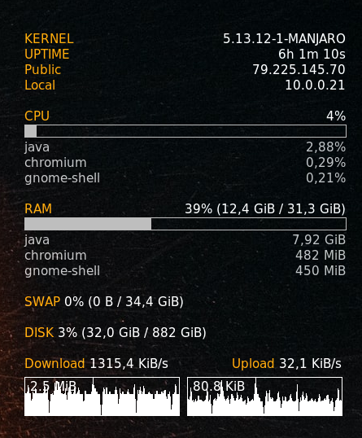

# Config
This project contains the configuration I use with conky.
If you want to use the same config clone the repo and move **config.conf** and **NvidiaSmiProcess.js** to **~/.config/conky** and endable Conky to run on user start.
 

# Docs

Find information about the configuration of conky on [ifxgroup](http://www.ifxgroup.net/conky.html) and about [Lua](https://www.lua.org/pil/1.html) to be able to modify the extension.