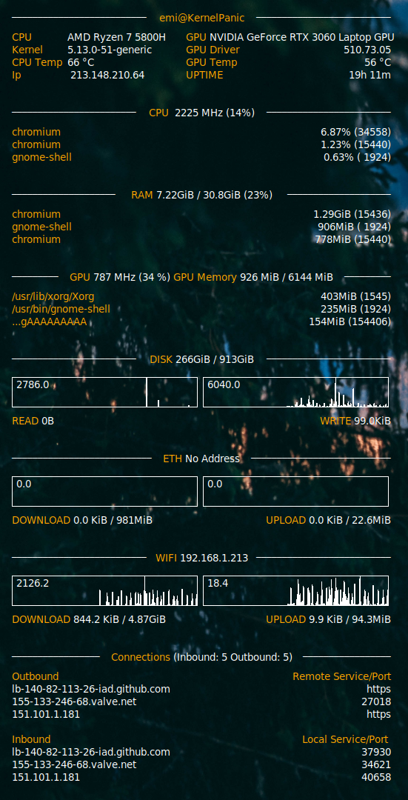

# Config
This project contains my own configuration for conky. It works with all devices becasue is based on default linux commands. No additional libraries are needed.

# Features

This configuration shows the basic information about **kernel**, **uptime**, **public** address,**private** address, **CPU** info with the top 3 processes on cpu usage, **RAM** info with top 3 processes on ram usage, swap usage, disk usage and network info both download and upload.

# Docs

Find information about the configuration of conky on [ifxgroup](http://www.ifxgroup.net/conky.html) and about [Lua](https://www.lua.org/pil/1.html) to be able to modify the extension.